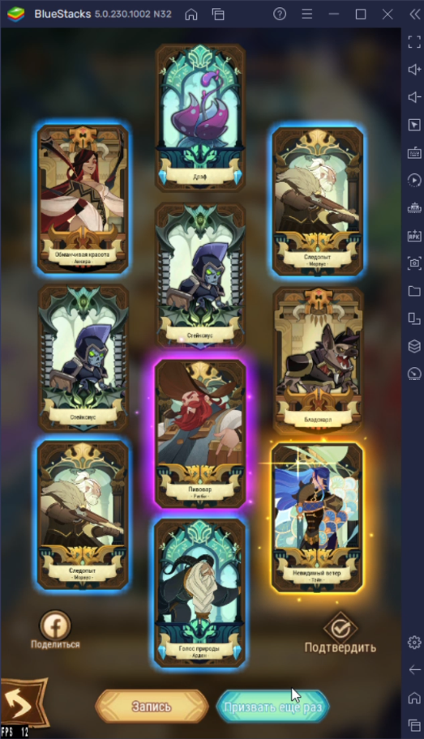
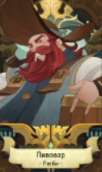

# AFKArenaBot
Бот для автоматических круток в AFK Arena. Крутки прожимаются автоматически до тех пор, пока на экране не появится комбинация из заданных героев.

# Как пользоваться
## Сетап
Для начала до запуска бота всех героев необходимо вручную выбить в крутках, каждого из них заскринить и скриншоты закинуть в папку `heroes` к боту. Так же перед запуском бота нужно, чтобы на экране была уже открыта крутка (как на первом скрине ниже).

**ВАЖНО:** Скриншот карты героя не должен содержать лишних деталей - чем их меньше, тем лучше. Скриншот должен быть обрезан, чтобы не включать элементы за пределами карты для лучшей работы бота.

**ПРИМЕЧАНИЕ:** Удобнее всего это делать через встроенный в винду `Win + Shift + S`.

Пример обрезки:

**ВАЖНО:** Легендарные карты в идеале постараться заскринить без бликов.

**ВАЖНО:** Очевидно, что в общей сложности скринов в папке `heroes` не должно быть больше 10 штук, иначе скрипт будет работать бесконечно, т.к. максимальное количество карт на экране - 10.

## Запуск бота
После запуска исполняемого файла бота нужно сделать `Alt + Tab` на Bluestacks, после чего поочередно сделать крутку еще один раз, **обязательно путем трех последовательных кликов мышью**:

1. Клик по кнопке "Призвать еще раз"
2. Клик по кнопке "Быстро перевернуть"
3. Клик по кнопке "Перевернуть все"

Это нужно для запоминания ботом мест, куда нужно кликать. Клики делать нужно с небольшой задержкой. В экране терминала отображаются запросы  `Waiting for first/second/third click...`, по которым можно понять, засчитался ли клик. Если все клики прошли, то в терминале должно отображаться `Bot is running...`.

Если не получилось с первого раза, либо нажали куда-то не туда: останавливаете бота нажатием на клавишу `Q`, перезапускаете его и пробуете еще раз по той же схеме.

## Работа бота
Далее никакого стороннего вмешательства не требуется. После каждой крутки бот анализирует карты на наличие всех совпадений со скриншотами в папке `heroes` и остановится автоматически, когда такое совпадение будет найдено.

Вручную бота можно остановить просто нажав кнопку `Q` на клавиатуре.

**ВАЖНО:** В процессе работы бота окно Bluestacks не перемещать (хотя это и вряд ли получится, т.к. бот перехватит курсор).

# Ошибки и неисправности
Если возникла неполадка, либо очевидна некорректная работа бота, писать мне в дискорд ***@asethone***, приложив файл `trace.log` из папки с ботом.
